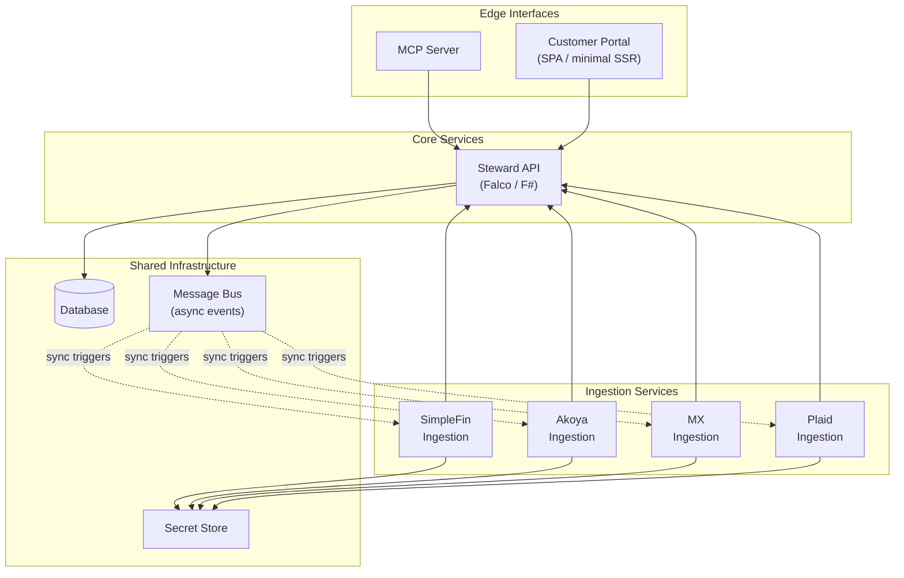
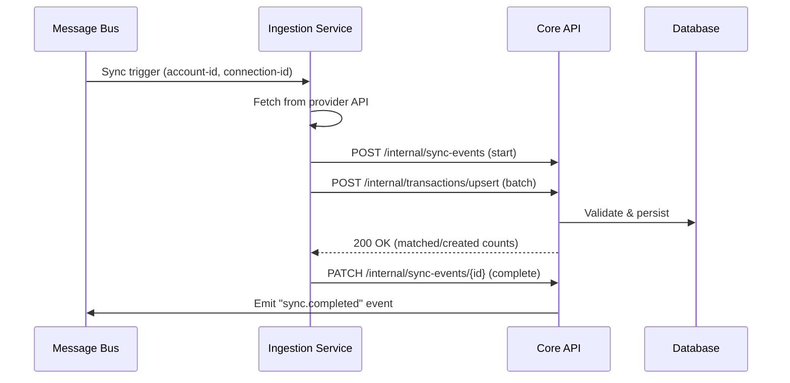
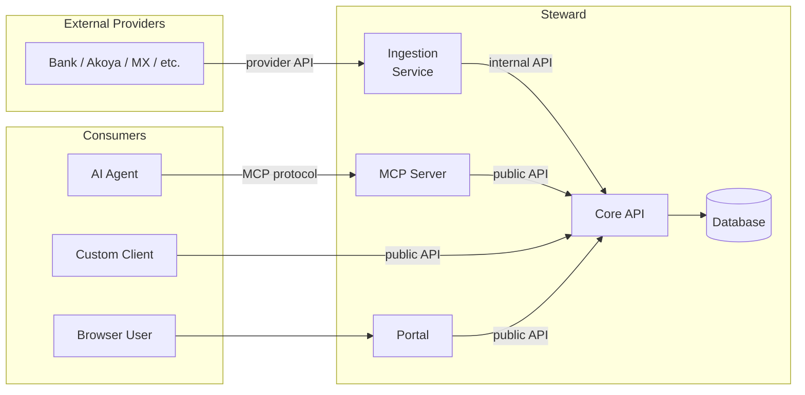
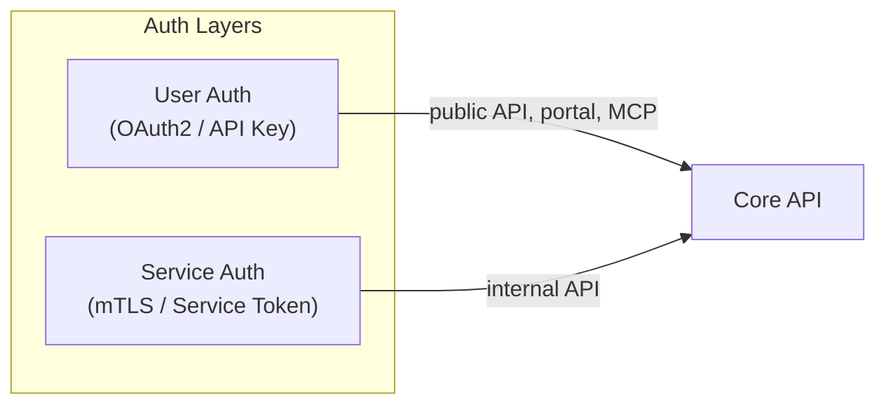

# ADR-006: High-level service architecture

## Status

Proposed

## Context

Steward needs a system architecture that supports:

1. **Separate aggregator ingestion services** — each financial data provider (Akoya, MX, SimpleFin, Plaid) runs as an independent service, decoupled from the core ledger.
2. **A public API and MCP server** as the flagship product — AI agents and third-party clients are first-class consumers.
3. **A lightweight customer portal** — not a rich first-party client, just enough for transaction viewing and account management. Users primarily interact through AI agents or their own clients.
4. **Cost-conscious hosting** — the architecture should be deployable on modest infrastructure and scale incrementally.

The existing domain model (ADRs 001–005) defines the data shapes. This ADR defines how the system is composed at the service level.

## Decision

### Service Decomposition

The system is organized into four tiers: **ingestion services**, a **core API**, **edge interfaces**, and **shared infrastructure**.

### Component Responsibilities

#### Ingestion Services (one per provider)

Each aggregator gets its own service/process:

- **Owns** the provider SDK/API integration, credential management, and rate-limit handling.
- **Translates** provider-specific transaction formats into the canonical domain types (`Transaction`, `SyncEvent`).
- **Pushes** normalized data to the Core API via its internal endpoints.
- **Receives** sync trigger messages from the message bus (scheduled or on-demand).
- **Reports** health and sync status back through `SyncEvent` records.

Separate services per provider means:
- A broken Plaid integration cannot take down Akoya syncing.
- Each service can be deployed, scaled, and updated independently.
- Provider-specific dependencies (SDKs, auth flows) are isolated.

#### Core API (Steward API)

The single source of truth for all domain operations:

- **Exposes internal endpoints** consumed by ingestion services (transaction upsert, sync event recording, account linking).
- **Exposes public endpoints** consumed by the MCP server, customer portal, and third-party clients.
- **Enforces** all domain invariants (single-entry rules, currency constraints, budget calculations).
- **Emits events** to the message bus for async workflows (sync scheduling, notifications).

The internal vs. public endpoint distinction is enforced via authentication scope, not separate services. Both live in the same Falco application to minimize operational overhead at this stage.

#### MCP Server

- Wraps the public API as an MCP tool/resource provider.
- Exposes resources: accounts, transactions, budgets, categories.
- Exposes tools: categorize transaction, create budget, trigger sync, reconcile.
- Stateless — all state lives in the Core API.
- Can be co-hosted with the Core API initially (as a route group) or split out later.

#### Customer Portal

- Minimal web UI for transaction list, account overview, and connection management.
- Consumes the same public API the MCP server does — no special backend.
- SPA or lightweight SSR (technology choice deferred; framework-agnostic at this layer).
- Not the primary user interface — exists for setup, verification, and users who prefer a visual view.

### Internal API Design

Communication between ingestion services and the Core API uses **HTTP/JSON over an internal network**:

Why HTTP/JSON rather than gRPC or direct DB access:
- **Simpler ops**: no protobuf compilation, no gRPC infrastructure; the team can debug with curl.
- **Domain enforcement**: all writes go through the API's domain logic — ingestion services cannot bypass invariants.
- **Upgrade path**: if throughput demands it later, specific hot-path endpoints can be promoted to gRPC without rearchitecting.

Internal endpoints are authenticated with service-to-service tokens (API keys or mTLS), scoped to ingestion operations only.

### Data Flow: End-to-End

### Authentication & Authorization

- **Users** authenticate via OAuth2 (for portal) or API keys (for programmatic access and MCP).
- **Ingestion services** authenticate via service tokens with restricted scopes.
- **MCP server** acts on behalf of authenticated users — the user's API key or session is forwarded through the MCP layer.

### Event Model

The message bus carries lightweight event envelopes for async coordination:

| Event | Producer | Consumers |
|-------|----------|-----------|
| `sync.requested` | Core API (scheduler or user action) | Ingestion services |
| `sync.completed` | Core API (after ingestion writes) | Notification service, portal (future) |
| `connection.status_changed` | Ingestion service | Core API, notification service |

The initial message bus can be as simple as an in-process channel or SQLite-backed queue. Graduate to Redis Streams or NATS when traffic justifies it.

## Considered Alternatives

### GraphQL (internal API, public API, or both)

GraphQL was evaluated for both the internal ingestion API and the public-facing API.

**Internal API**: REST is the better fit. The ingestion services perform fixed, command-oriented operations (batch upsert transactions, record sync events). The payloads are predictable and narrow — there is no over-fetching problem to solve, and GraphQL's schema/resolver overhead adds complexity without benefit.

**Public API**: GraphQL has genuine appeal here:

- The portal and third-party clients may want different projections of the same data (e.g., transactions with categories vs. transactions with account details). GraphQL handles this naturally.
- AI agents could construct flexible queries without us predicting every access pattern.
- Reduces round-trips for the portal (fetch account + recent transactions + budget status in one call).

However, we chose REST for the public API at launch for these reasons:

1. **MCP is the primary interface.** AI agents interact through MCP tools, not the HTTP API directly. MCP already provides the "flexible query" layer — agents call our tools, we decide what to fetch internally. GraphQL at the public boundary is redundant for the flagship use case.
2. **F# ecosystem maturity.** GraphQL libraries for F# (e.g., FSharp.Data.GraphQL) are less mature than the REST tooling around Falco and ASP.NET Core. More friction to ship the initial product.
3. **Authorization surface area.** GraphQL's flexibility requires field-level access control rather than endpoint-level. For a financial API handling account balances and transaction data, that's a non-trivial security surface to get right from day one.
4. **Portal is intentionally minimal.** A handful of REST endpoints covers the portal's needs without a schema/resolver layer.

**Upgrade path**: if third-party clients or the portal outgrow REST (too many bespoke endpoints, excessive round-trips), GraphQL can be layered on top of the same domain logic as another route group in the Falco application — no rearchitecture required.

## Consequences

- **Isolation**: a provider outage or SDK bug is contained to one ingestion service. The core API and other providers continue operating.
- **Testability**: ingestion services can be tested against provider sandboxes independently. The core API is tested against its internal contract.
- **Incremental build**: we can ship with SimpleFin only, add Akoya/MX/Plaid as separate deployments without touching the core.
- **Operational simplicity**: at launch, all services can run as processes on a single host. The architecture supports splitting to separate hosts/containers when needed.
- **Trade-off — HTTP overhead**: internal HTTP adds latency vs. direct DB writes. For the expected transaction volumes (personal finance, not HFT), this is negligible.
- **Trade-off — eventual consistency**: async event-driven sync means the portal may show slightly stale data between syncs. This is acceptable for the use case and matches user expectations (bank data is already delayed).

## Related Decisions

- [ADR-005](005-data-feed-abstraction.md): defines the domain-level data feed abstractions that ingestion services implement.
- [ADR-007](007-deployment-and-hosting.md): covers how these services are deployed and hosted.
