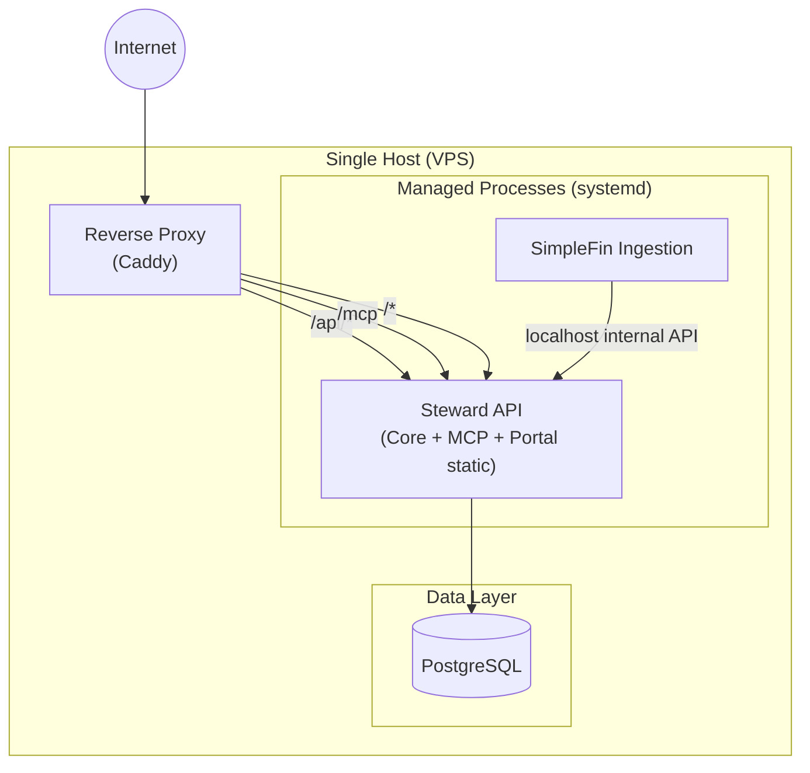
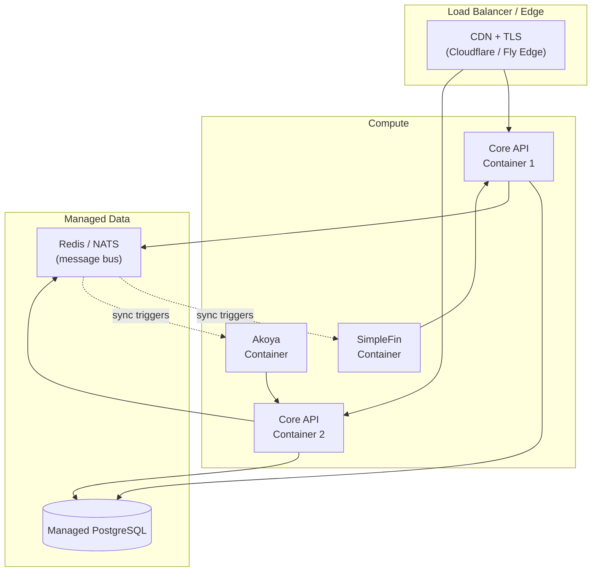
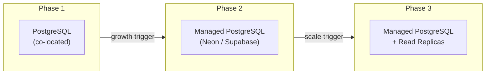

# ADR-007: Deployment and hosting strategy

## Status

Proposed

## Context

Steward's architecture (ADR-006) defines multiple services: a core API, per-provider ingestion services, an MCP server, and a customer portal. We need a deployment strategy that:

1. Keeps hosting costs low during early stages (pre-revenue, small user base).
2. Scales incrementally without a full rearchitecture.
3. Supports the operational reality of a small team (or solo founder + AI agents).
4. Doesn't lock us into a specific cloud vendor unnecessarily.

## Decision

### Phase 1: Single-Host Deployment

At launch, all services run on a single Linux VPS or small cloud instance:

Key characteristics:
- **Single binary for Core API + MCP**: the MCP server is a route group within the Falco application, not a separate process. Split it out only when scaling demands it.
- **Portal served as static files**: the portal SPA is built at deploy time and served by Caddy or the API itself. No separate Node.js process.
- **PostgreSQL on the same host**: for early stage, co-located is fine. Move to managed Postgres (e.g., Neon, Supabase, or cloud-provider managed) when the data or uptime requirements justify it.
- **One ingestion service**: start with SimpleFin only. Additional providers are added as separate systemd units.
- **Caddy as reverse proxy**: automatic HTTPS via Let's Encrypt, minimal config, handles TLS termination.

Estimated cost: **$5–20/month** (Hetzner, DigitalOcean, or Fly.io small instance).

### Phase 2: Container-Based Multi-Host

When traffic or reliability requirements outgrow a single host:

Migration triggers:
- Need for zero-downtime deploys.
- Adding a second ingestion provider.
- User count exceeding what a single Postgres instance handles comfortably.

### Phase 3: Managed Platform (if warranted)

If Steward grows to significant scale, move to a managed container platform (Fly.io Machines, Railway, or Kubernetes). The architecture from Phase 2 maps directly — each service is already containerized, stateless, and communicates over HTTP.

This phase is not planned; it's documented to show the architecture supports it without redesign.

### Database Strategy

- **PostgreSQL from day one**. SQLite was considered for local-first simplicity, but multi-service access and concurrent writes favor Postgres even at small scale.
- **Schema migrations** managed via a migration tool (e.g., DbUp or Evolve for .NET). Migrations are versioned and applied at startup or via CLI.
- **Backups**: automated pg_dump on Phase 1; managed backups on Phase 2+.

### MCP Hosting Considerations

The MCP server has specific hosting requirements:

- **Streamable HTTP transport**: MCP uses HTTP with SSE for streaming. The reverse proxy must support long-lived connections and SSE passthrough.
- **Stateless sessions**: MCP session state (if any) lives in the Core API, not the MCP layer. This allows horizontal scaling of MCP endpoints.
- **Auth passthrough**: the MCP server forwards user credentials to the Core API. No separate auth database.

### Cost Projections

| Phase | Monthly Cost | Supports |
|-------|-------------|----------|
| Phase 1 (VPS) | $5–20 | 1–100 users, 1 provider |
| Phase 2 (Containers) | $40–100 | 100–10k users, multiple providers |
| Phase 3 (Managed platform) | $200+ | 10k+ users, HA requirements |

Cost drivers:
- **Database**: the largest cost at every phase. Managed Postgres alone is $15–30/month minimum.
- **Compute**: F# on .NET is memory-efficient; the API idles at ~50MB RAM.
- **Bandwidth**: minimal for a financial API (small JSON payloads, no media).
- **Provider API costs**: Plaid and Akoya have per-connection fees that may dominate hosting costs at scale. SimpleFin is free/donation-based.

### Deployment Tooling

- **Phase 1**: `dotnet publish` → rsync/scp → systemd restart. Or a simple GitHub Actions workflow.
- **Phase 2**: Dockerfile per service → docker-compose or Fly.io `fly deploy`.
- **Monitoring**: structured logging (Serilog) → a free-tier log aggregator (Seq Community, Grafana Cloud free). Health check endpoints per service.

## Consequences

- **Low barrier to launch**: a working system for under $20/month. No Kubernetes, no managed container orchestration, no multi-region complexity.
- **Incremental scaling**: each phase builds on the previous one. No throw-away work.
- **Vendor flexibility**: PostgreSQL + HTTP + containers = portable to any cloud or self-hosted.
- **Trade-off — single point of failure in Phase 1**: if the VPS goes down, everything is down. Acceptable for early stage; mitigated by automated backups and the ability to rebuild from a container image.
- **Trade-off — no HA until Phase 2**: this is a conscious choice to avoid premature infrastructure complexity.

## Related Decisions

- [ADR-006](006-high-level-service-architecture.md): defines the services being deployed.
- [ADR-005](005-data-feed-abstraction.md): the ingestion service abstraction that makes per-provider deployment possible.
