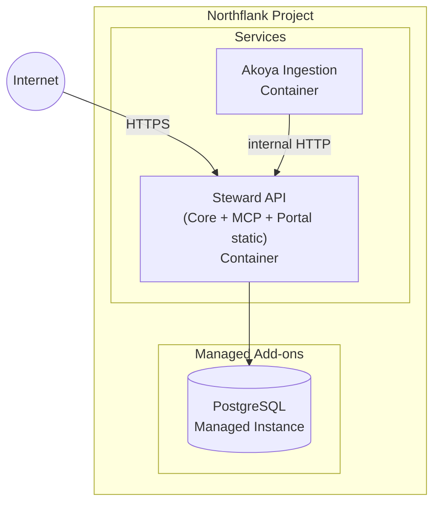
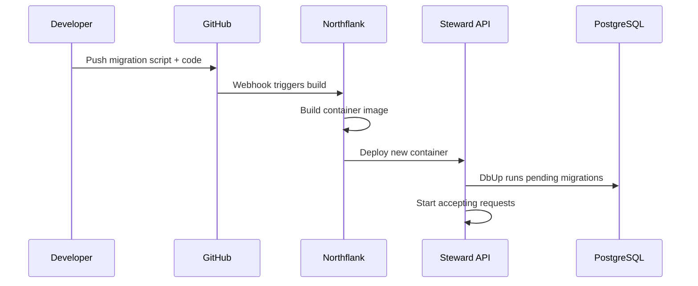

# ADR-007: Deployment and hosting strategy

## Status

Proposed

## Context

Steward's architecture (ADR-006) defines multiple services: a core API, per-provider ingestion services, an MCP server, and a customer portal. We need a deployment strategy that:

1. Keeps hosting costs low during early stages (pre-revenue, small user base).
2. Scales incrementally without a full rearchitecture.
3. Supports the operational reality of a small team (or solo founder + AI agents).
4. Doesn't lock us into a specific cloud vendor unnecessarily.

## Decision

### Platform: Northflank

All services are deployed on [Northflank](https://northflank.com), a container hosting platform that provides managed services, deployment pipelines, and environment management through a single dashboard and API.

Northflank was selected for:
- **Simplicity**: container deploys from a Dockerfile or buildpack with zero orchestration config.
- **Managed add-ons**: PostgreSQL (and Redis, if needed later) provisioned as managed add-ons — no separate database hosting to manage.
- **Cost**: the smallest container and database configurations keep early-stage costs minimal.
- **Git-push deploys**: connect a GitHub repo, push to a branch, and Northflank builds and deploys automatically.
- **API-driven**: Northflank's REST API allows infrastructure changes to be scripted and automated by CI or agents.

### Service Topology

Key characteristics:
- **Single container for Core API + MCP + Portal**: the MCP server is a route group within the Falco application. The portal SPA is built at deploy time and served by the API. Split into separate services only when scaling demands it.
- **One ingestion container**: start with Akoya only. Plaid is planned as the next provider, deployed as a separate Northflank service.
- **Managed PostgreSQL add-on**: Northflank provisions and manages the Postgres instance. Connection strings are injected as environment variables. Backups are handled by the platform.
- **Smallest resource tier**: use the minimum container size (CPU/RAM) and smallest Postgres instance that Northflank offers. Scale up through the dashboard or API when needed.

### Database Strategy

- **PostgreSQL from day one** via Northflank's managed add-on. No self-managed database infrastructure.
- **Schema migrations via [DbUp](https://dbup.readthedocs.io/)**. DbUp is a .NET library that runs SQL migration scripts in order. Migrations are embedded in the API project and applied at application startup.
- **Migration workflow**:
  1. Developer adds a numbered SQL script to the migrations folder (e.g., `0003-add-budget-table.sql`).
  2. On deploy, the API startup code runs DbUp against the database connection string.
  3. DbUp tracks which scripts have been applied in a `SchemaVersions` journal table and only runs new ones.
  4. For destructive migrations, run manually via CLI before deploy.

### MCP Hosting Considerations

The MCP server has specific hosting requirements:

- **Streamable HTTP transport**: MCP uses HTTP with SSE for streaming. Northflank's routing must support long-lived connections and SSE passthrough.
- **Stateless sessions**: MCP session state (if any) lives in the Core API, not the MCP layer. This allows horizontal scaling of MCP endpoints.
- **Auth passthrough**: the MCP server forwards user credentials to the Core API. No separate auth database.

### Scaling Path

Northflank supports incremental scaling without rearchitecting:

| Trigger | Action |
|---------|--------|
| API response times degrade | Scale up container resources or add replicas |
| Adding Plaid (second provider) | Deploy as a new Northflank service |
| Database performance bottleneck | Scale up the managed Postgres add-on |
| Need for async job processing | Add a Redis add-on and worker service |

All scaling is done through Northflank's dashboard or API — no migration to a different platform.

### Deployment Tooling

- **Build**: Northflank builds from a `Dockerfile` in the repo root. GitHub push to the deploy branch triggers a build.
- **Environment config**: secrets and connection strings managed as Northflank environment variables, injected at runtime.
- **Monitoring**: structured logging (Serilog) to stdout, captured by Northflank's log viewer. Health check endpoints per service for Northflank's built-in health monitoring.
- **CI**: GitHub Actions runs build and test checks. Northflank handles the deploy pipeline after merge.

### Cost Projections

| Scale | Monthly Cost (est.) | Configuration |
|-------|-------------------|---------------|
| Launch (1–100 users) | $10–30 | Smallest container + smallest managed Postgres |
| Growth (100–1k users) | $40–80 | Scaled container + larger Postgres tier |
| Scale (1k+ users) | $100+ | Multiple container replicas + production Postgres |

Cost drivers:
- **Database**: managed Postgres is the largest fixed cost.
- **Compute**: F# on .NET is memory-efficient; the API idles at ~50MB RAM.
- **Bandwidth**: minimal for a financial API (small JSON payloads, no media).
- **Provider API costs**: Akoya and Plaid have per-connection fees that may dominate hosting costs at scale. Frequent re-sync scheduling increases API call volume, so provider rate limits and pricing tiers are a key cost factor.

## Consequences

- **Low barrier to launch**: a working system on Northflank's smallest tier. No Kubernetes, no VPS administration, no manual TLS management.
- **Managed database**: backups, connection pooling, and upgrades handled by the platform. One fewer operational concern for a small team.
- **DbUp for migrations**: simple, well-understood SQL-script-based migrations that run at startup. No ORM migration framework complexity.
- **Incremental scaling**: scale containers and database independently through the Northflank dashboard or API.
- **Vendor coupling**: we are dependent on Northflank for hosting. Mitigation: all services are standard Docker containers and the database is standard PostgreSQL — portable to any container host or managed Postgres provider.
- **Trade-off — no multi-region**: Northflank runs in a single region. Acceptable for early stage; revisit if latency or compliance requires geographic distribution.

## Considered Alternatives

### Self-Managed VPS (Hetzner, DigitalOcean)

Running all services on a single Linux VPS with systemd and Caddy as a reverse proxy. Lower monthly cost ($5–20) but requires manual server administration, TLS setup, database backups, and deployment scripting. The operational burden outweighs the cost savings for a small team.

### Fly.io / Railway

Similar managed container platforms. Northflank was preferred for its managed Postgres add-on pricing and API-driven infrastructure management.

## Related Decisions

- [ADR-006](006-high-level-service-architecture.md): defines the services being deployed.
- [ADR-005](005-data-feed-abstraction.md): the ingestion service abstraction that makes per-provider deployment possible.
